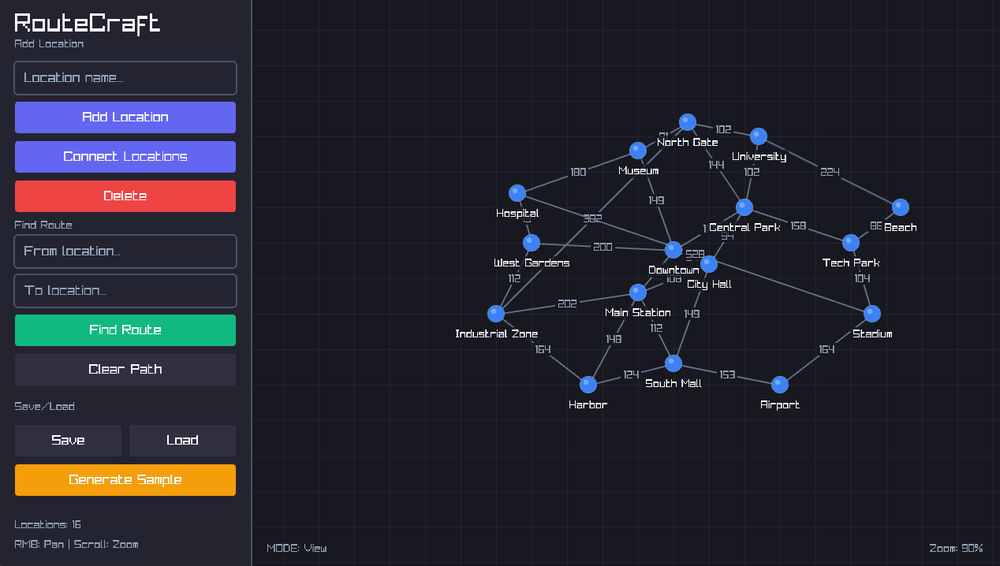

# RouteCraft 🗺️

A beautiful, cross-platform desktop application that visualizes the **A\* (A-Star) pathfinding algorithm** using a simplified map representation. This educational tool demonstrates how heuristic search algorithms power real-world routing applications like Google Maps.



## Features ✨

- **Interactive Map Editor**: Create locations and connect them with roads
- **A\* Pathfinding**: Find the shortest route between any two locations
- **Algorithm Visualization**: Watch the A\* algorithm explore the graph
- **Beautiful UI**: Modern, dark-themed interface with smooth animations
- **Save/Load Maps**: Persist your maps to disk
- **Cross-Platform**: Works on Windows, Linux, and macOS

## The A* Algorithm 🧠

The A\* algorithm is a **best-first search algorithm** that finds the shortest path between two nodes in a weighted graph. It combines:

- **Dijkstra's Algorithm**: Guarantees the shortest path
- **Greedy Best-First Search**: Uses heuristics for efficiency

### How It Works

For each node, A\* calculates:
- **g(n)**: The actual cost from the start node to node n
- **h(n)**: The heuristic estimate from node n to the goal (we use Euclidean distance)
- **f(n) = g(n) + h(n)**: The total estimated cost

The algorithm always expands the node with the lowest f(n) value, efficiently guiding the search toward the goal.

### Why A\* Matters

A\* is used in:
- 🗺️ GPS Navigation (Google Maps, Waze)
- 🎮 Video Games (NPC pathfinding)
- 🤖 Robotics (robot navigation)
- 📦 Logistics (delivery route optimization)

## Building 🔨

### Prerequisites

- **GCC/G++** compiler (MinGW on Windows)
- **Raylib** library installed
- **Make** build tool

### Quick Start (Automatic Raylib Installation)

The Makefile can automatically install Raylib for your platform:

```bash
# Check if Raylib is installed
make check-raylib

# Install Raylib (platform-specific)
make install-raylib

# Build the project
make
```

### Windows

```powershell
# Option 1: Automatic installation
make install-raylib

# Option 2: Using winget
winget install raysan5.raylib

# Option 3: Manual installation
# 1. Download from https://github.com/raysan5/raylib/releases
# 2. Extract to C:\raylib\raylib
# 3. Set RAYLIB_PATH environment variable (or use default)

# Build
make
```

### Linux

```bash
# Option 1: Automatic installation (recommended)
make install-raylib

# Option 2: Using package manager
sudo apt install libraylib-dev   # Debian/Ubuntu
sudo dnf install raylib-devel    # Fedora
sudo pacman -S raylib            # Arch

# Build
make
```

### macOS

```bash
# Option 1: Automatic installation (uses Homebrew)
make install-raylib

# Option 2: Manual Homebrew install
brew install raylib

# Build
make
```

### Build Options

```bash
# Standard build (separate compilation units)
make

# Unity build (single compilation unit - faster builds, better optimization)
make unity

# Debug build (with debug symbols)
make debug

# Build and run
make run

# Clean build artifacts
make clean

# Show all available targets
make help
```

### Unity Build ⚡

The unity build compiles all source files as a single translation unit. This provides:

- **Faster compilation**: Single compilation pass
- **Better optimization**: Compiler sees all code at once
- **Smaller binary**: More inlining opportunities
- **Simpler builds**: No intermediate object files

```bash
# Build using unity build
make unity
```

The unity build uses `src/unity_build.c` which includes all source files:
```c
// Core modules
#include "graph.c"
#include "astar.c"

// UI components  
#include "ui.c"

// Main application
#include "main.c"
```

### Running

```bash
make run
```


Or run the executable directly from the `build/` folder.

## Usage 📖

### Adding Locations
1. Enter a name in the "Location name" field (optional)
2. Click **➕ Add Location**
3. Click anywhere on the map to place the location

### Connecting Locations
1. Click **🔗 Connect Locations**
2. Click on the first location
3. Click on the second location
4. A road will be created with distance as the weight

### Finding Routes
1. Enter the origin in "From location..." (partial names work!)
2. Enter the destination in "To location..."
3. Click **🔍 Find Route**
4. Watch the algorithm explore and find the path!

### Navigation
- **Right-click + drag**: Pan the map
- **Scroll wheel**: Zoom in/out
- **ESC**: Cancel current action

### Saving/Loading
- Click **💾 Save** to save your map
- Click **📂 Load** to load a saved map
- Click **🗺️ Generate Sample** to create a demo city map

## Project Structure 📁

```
routecraft/
├── src/
│   ├── main.c          # Application entry point and main loop
│   ├── graph.h/.c      # Graph data structure (nodes, edges)
│   ├── astar.h/.c      # A* pathfinding implementation
│   └── ui.h/.c         # User interface components
├── build/              # Compiled output
├── Makefile            # Cross-platform build script
└── README.md
```

## Technical Details 🔧

### Graph Representation
- **Adjacency List**: Efficient for sparse graphs (typical road networks)
- **Bidirectional Edges**: Roads are traversable in both directions
- **Distance Weights**: Edge weights represent road distances

### A* Implementation
- **Priority Queue**: Binary min-heap for O(log n) operations
- **Heuristics**: Euclidean, Manhattan, Chebyshev, or Zero (Dijkstra)
- **Statistics**: Tracks nodes explored, search time, etc.

### Serialization
- Custom binary format (`.rcg` files)
- Magic number header for validation
- Compact storage of nodes and edges

## Performance 📊

The A\* algorithm achieves:
- **Time Complexity**: O(E log V) where E = edges, V = vertices
- **Space Complexity**: O(V)

For typical city maps with thousands of nodes, pathfinding completes in milliseconds.

## Educational Value 🎓

This project demonstrates:
1. **Graph Theory**: Nodes, edges, weighted graphs
2. **Search Algorithms**: Heuristic vs. exhaustive search
3. **Data Structures**: Priority queues, adjacency lists
4. **Algorithm Design**: Trading optimality for efficiency
5. **Software Engineering**: Modular code, serialization, UI design

## Future Improvements 🚀

- [ ] Multiple heuristic options in UI
- [ ] Step-by-step algorithm visualization
- [ ] Import real map data (OpenStreetMap)
- [ ] Traffic/weight modification
- [ ] Multiple path alternatives
- [ ] Turn-by-turn directions

## License 📄

MIT License - See [LICENSE](LICENSE) for details.

## Acknowledgments 🙏

- [Raylib](https://www.raylib.com/) - Simple and easy-to-use game development library
- Peter Hart, Nils Nilsson, and Bertram Raphael - Original A\* algorithm (1968)
